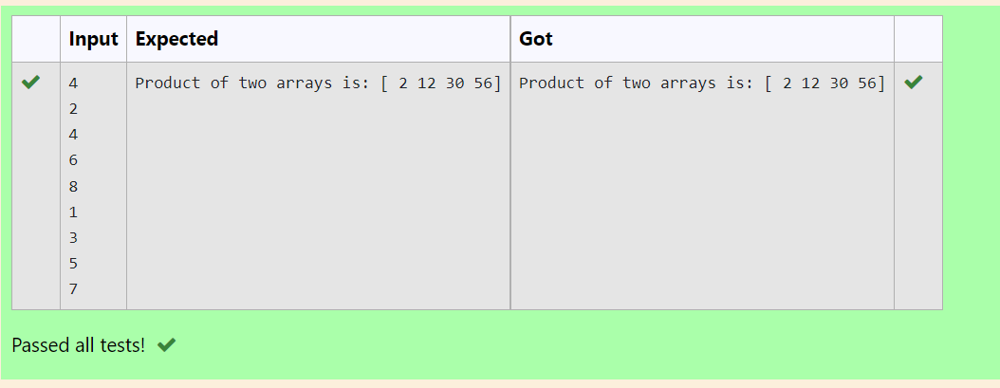

# Multiplying-two-matrix

## AIM: 
     To Multiply two array     

## ALGORITHM:

### Step 1:  Import numpy as np
### Step 2:  Create an empty list
### Step 3:  Use append of the two lists
### Step 4:  Assign the arrays  
### Step 5:  In result multiply the assigned variables
### Step 6:  Run the program

## PROGRAM: 
import numpy as np
n = int(input())
m1,m2=[],[]
for i in range(n):
    m1.append(int(input()))
for i in range(n):
    m2.append(int(input()))
A = np.array(m1)
B = np.array(m2)
result = A*B
print("Product of two arrays is:",result)

## OUTPUT:

## RESULT:
       Multiplying two arrays is successfully completed

